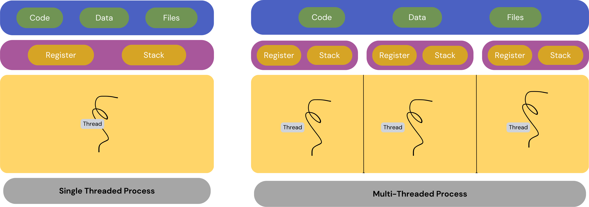

+++
title = "Hands-On Rust Threads: A Journey from Basics to Real-World Examples"
date = 2024-02-01
author = "BOULBALAH Lahcen"
tags = ["Rust","Thread","Safety"]
keywords = ["Rust", "Thread programming"]
description = "Explaining Rust Threads with Examples and Use Cases"
showFullContent = false
+++

# Introduction

In the fast-evolving landscape of programming languages, Rust has emerged as a robust and efficient choice for system-level programming, known for its focus on memory safety without sacrificing performance. One of the key features that contribute to Rust's prowess is its threading model, which enables developers to harness the power of parallelism in their applications.

In today's blog post, we delve into the world of Rust threads, unraveling the intricacies of how they function and exploring practical examples of how they can be employed to enhance the performance of your code. Whether you are a seasoned Rust developer or someone just starting to explore the language, understanding the fundamentals of Rust threads is crucial for unlocking the full potential of concurrent programming.

# Introduction to Rust Threads

<!--  -->

# Creation of Threads in Rust

# Thread Communication

# Practical Examples

# Use Cases

# Conclusion